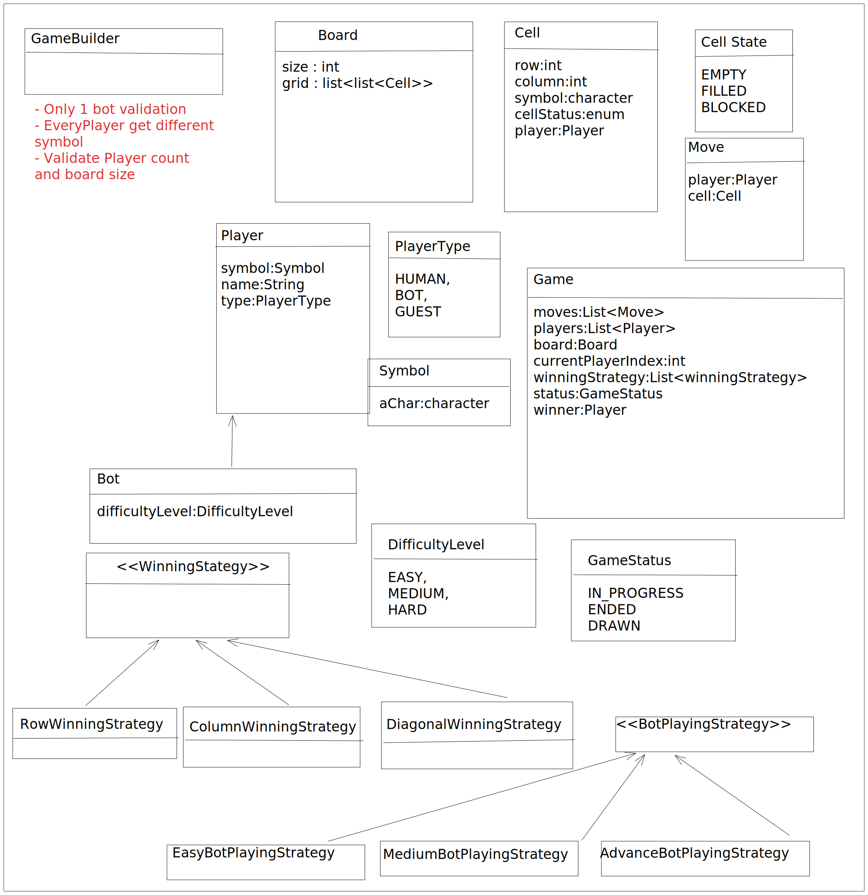

# tic-tac-toe
Tic Tac Toe - Java

### Requirement Gathering
```markdown
1. Size of board can be any 'n'.
2. Number of players will be n-1.
3. Support for bots, with different difficulty level.
4. Every player should have different symbol for the board.
5. Max 1 bot per game.
6. Global Undo Operation.
7. Replay Game.
```
### Class Diagram



